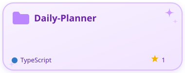
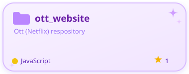
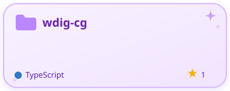
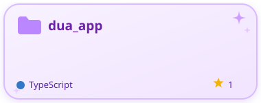

<!-- ===== HEADER ===== -->
<h1>Hi, I'm Madiha 👋</h1>

Software developer • building things with code

 

<!-- ===== TOP STATS ROW (Repos / Stars / Languages) ===== -->

  

<!-- ===== TOOLS / LANGUAGES I KNOW ===== -->

### 🛠️ Languages & Tools

<!--
  This row uses skillicons.dev — replace the "i=" list below with whatever you actually use.
  Full list of supported icon codes: https://skillicons.dev
  Example codes: js, ts, python, java, cpp, html, css, react, nextjs, vue, angular,
  nodejs, express, django, flask, spring, dotnet, php, laravel, swift, kotlin, dart, flutter,
  git, github, docker, kubernetes, aws, azure, gcp, figma, postman, mysql, postgres,
  mongodb, redis, firebase, vscode, linux, bash, tailwind, graphql
-->

  

<!-- ===== PINNED REPOS ===== -->
<h3>📌 Pinned Repositories</h3>

  
  

  
  

  

<!-- ===== CONTRIBUTIONS / STREAK / COMMITS ===== -->

### 🔥 Contributions & Streaks

  

<!-- ===== CONTRIBUTION ACTIVITY GRAPH ===== -->

